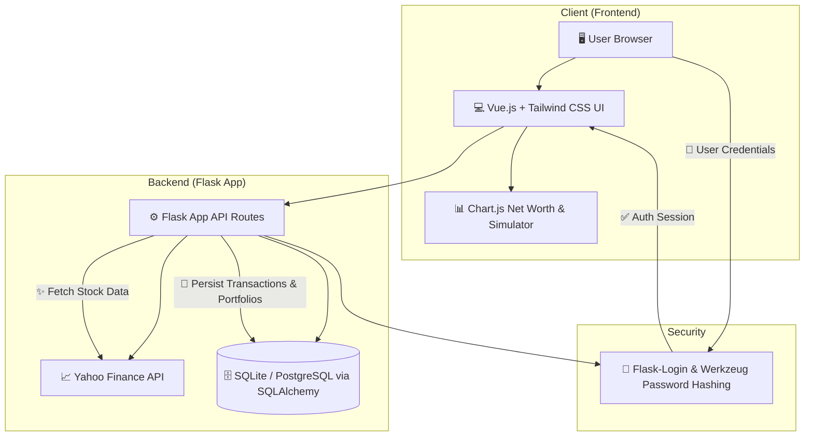

# 🚀 IntelliVest - Smart Financial Intelligence


---

## 📖 About The Project

**IntelliVest** is a smart financial optimization and portfolio tracking tool designed to empower users with real-time financial intelligence. With a premium dark-themed UI built with **Tailwind CSS and Vue.js**, IntelliVest acts as a personal financial planner, tracking budgets, transactions, investments, and simulating future growth through compounding.

The application integrates the **Yahoo Finance (yfinance) API** for real-time market indices and stock price data, backed by a persistent relational database configured for local development and scalable cloud deployment.

🌍 **Live Demo:** [[https://intellivest-project-v2.onrender.com](https://intelli-vest-project-v2.vercel.app/)

---

## ✨ Key Features

- 📈 **Real-Time Market Tracking** – Track major indices (SENSEX, NIFTY 50, BANK NIFTY, NASDAQ) and search specific Indian stocks with real-time price updates.
- 💰 **Budget Planner & Tracker** – Create customized categories with visual spending indicators, limits, and dynamic updates as expenses are added.
- 🧠 **Financial Compound Simulator** – Input upfront costs and monthly savings parameters to visually compare current trajectory vs. optimized scenarios (12% compounding interest).
- 💼 **AI Investment Planner & Portfolio** – Create stock watchlists, view stock price updates, and manage your asset distributions.
- 🔐 **Secure Session Management** – Secure user registration and authentication powered by **Flask-Login** and **Werkzeug** security hashing.
- 📱 **Mobile Access Companion** – Generate QR code links dynamically to access the application dashboard easily from your mobile device.
- 💳 **Integrated Support** – Custom donation interface with UPI QR code scanning for seamless developer support.

---

## 📸 Screenshots

### Financial Intelligence Dashboard

![Dashboard]


---

## 📁 Directory Structure

The project is structured logically to separate the backend logic from templates and assets:

```
Directory structure:
└── IntelliVest_Project_v2/
    ├── README.md
    ├── Procfile
    ├── app.py
    ├── models.py
    ├── requirements.txt
    ├── check_users.py
    ├── cleanup_demo.py
    ├── deploy.ps1
    ├── reset_password.py
    ├── setup_deploy.bat
    ├── verify_user.py
    ├── static/
    │   └── dashboard.png
    └── templates/
        ├── budgets.html
        ├── calculator.html
        ├── index.html
        ├── invest.html
        ├── login.html
        ├── market.html
        ├── mobile.html
        ├── settings.html
        └── signup.html
```

### Key Folders and Files:
- **[app.py](file:///c:/Users/SHAHLA/.gemini/antigravity-ide/scratch/IntelliVest_Project_v2/app.py)** – Main application runner containing Flask routing, API endpoints (Simulation, Dashboard, Portfolio), and database initializations.
- **[models.py](file:///c:/Users/SHAHLA/.gemini/antigravity-ide/scratch/IntelliVest_Project_v2/models.py)** – Database schema declarations for Users, Transactions, Portfolios, and Budgets.
- **[templates/](file:///c:/Users/SHAHLA/.gemini/antigravity-ide/scratch/IntelliVest_Project_v2/templates)** – Jinja2 HTML templates containing Vue.js reactive bindings, Tailwind styling, and Chart.js visualizations.
- **[static/](file:///c:/Users/SHAHLA/.gemini/antigravity-ide/scratch/IntelliVest_Project_v2/static)** – Static assets served by Flask, including the dashboard screenshot and other media.

---

## 🏗️ Architecture

IntelliVest utilizes a client-server architecture. The frontend is powered by a reactive Vue.js interface embedded inside server-rendered templates, and the backend handles routing, data calculations, authentication, and database writes.



---

## 🛠 Built With

- **Backend:** Python, Flask, Flask-SQLAlchemy, Flask-Login
- **Frontend:** Vue.js 3 (via CDN), Tailwind CSS, Chart.js, FontAwesome 6, Outfit Google Font
- **APIs:** Yahoo Finance (yfinance)
- **Database:** SQLite (Development) / PostgreSQL (Production)

---

## ⚙️ Getting Started

### Prerequisites

- Python 3.8+
- Git

### Installation

1. Clone the repository:
```bash
git clone https://github.com/physicswallah5851-cell/IntelliVest.git
cd IntelliVest_Project_v2
```

2. Create and activate a virtual environment:
```bash
python -m venv venv
# On Windows:
venv\Scripts\activate
# On macOS/Linux:
source venv/bin/activate
```

3. Install required packages:
```bash
pip install -r requirements.txt
```

### Database Initialization

The database schema is automatically built on application startup. To inspect or manage users manually, you can use the helper utilities provided:
- To verify the demo user creation:
  ```bash
  python verify_user.py
  ```
- To list all database users:
  ```bash
  python check_users.py
  ```

### Run Locally

Start the local development server:
```bash
python app.py
```
Visit the application at [http://localhost:8080](http://localhost:8080)

---

## 🛣️ Roadmap

- [x] Secure Authentication & Custom Profiles
- [x] Budget Tracker & Spending Limits
- [x] Real-time Yahoo Finance Index Dashboard
- [x] Compound Investment Simulator
- [ ] Multiple Currency Support (USD, EUR)
- [ ] AI-Powered Stock Recommendations Engine
- [ ] Export Financial Data to PDF/CSV Reports
- [ ] Full Cloud Deploy to Render / Railway

---

## 📜 License

Distributed under the MIT License. See `LICENSE` for more information.
This project is licensed under the MIT License.
© 2026 IntelliVest. Educational use only.
## 📬 Contact

👨‍💻 **Saifan Nayyar**  
📧 **saifan0218@gmail.com**

---

### ⭐ Show some love!

If you like this project, **give it a star ⭐ on GitHub**!

