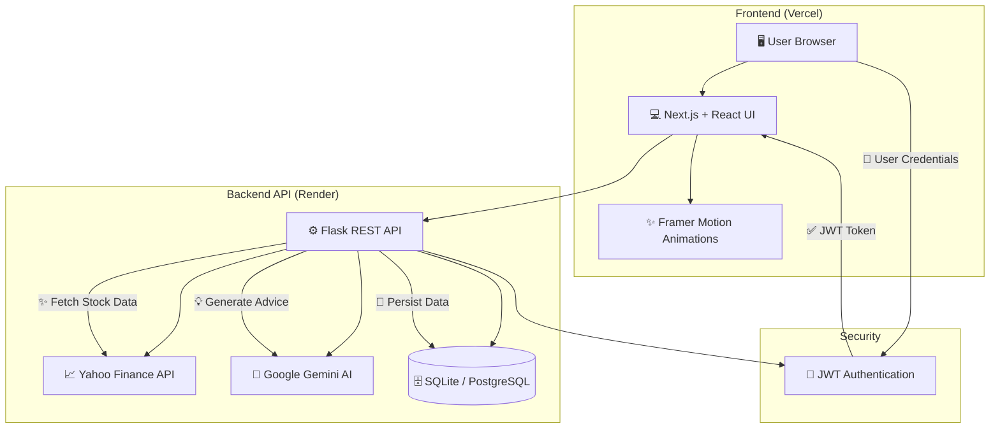

# 🚀 IntelliVest - Smart Financial Intelligence & AI Advisor


---

## 📖 About The Project

**IntelliVest** is a smart financial optimization, portfolio tracking, and AI-powered advisory tool designed to empower users with real-time financial intelligence. Upgraded to a modern, split-stack architecture, IntelliVest features a premium, ultra-responsive dark-themed frontend built with **Next.js, React, Tailwind CSS, and Framer Motion**, seamlessly communicating with a robust **Python Flask** backend.

The application integrates the **Yahoo Finance (yfinance) API** for real-time market indices and stock price data, and leverages **Google Gemini AI** to provide personalized, intelligent financial advice based on your exact portfolio, transactions, and budget data.

🌍 **Live Frontend (Vercel):** [https://intelli-vest-project-v2.vercel.app/](https://intelli-vest-project-v2.vercel.app/)  
⚙️ **Live Backend API (Render):** [https://intellivest-project-v2.onrender.com](https://intellivest-project-v2.onrender.com/)

---

## ✨ Key Features

- 🤖 **AI Financial Advisor** – Get personalized insights and specific "BUY/SELL/HOLD" recommendations generated by Google Gemini AI based on your real-time portfolio and budget.
- 📈 **Real-Time Market Tracking** – Track major indices and search specific stocks globally with real-time price updates and technical analysis scoring.
- 💰 **Budget Planner & Tracker** – Create customized categories with visual spending indicators, limits, and dynamic updates as expenses are added.
- 💼 **Intelligent Portfolio Management** – Create stock watchlists, view live stock price updates, and manage your asset distributions beautifully.
- 🔐 **Secure JWT Session Management** – Secure user registration and authentication powered by JSON Web Tokens and secure password hashing.
- 🎨 **Premium Aesthetic UI** – Immersive dark mode, interactive Framer Motion micro-animations, glassmorphism, and responsive design for both desktop and mobile.

---

## 📸 Screenshots

### Financial Intelligence Dashboard


---

## 📁 Directory Structure

The project is structured into a modern split-stack repository, separating the React frontend from the Python backend:

```
IntelliVest_Project_v2/
├── frontend/                 # Next.js Frontend Application
│   ├── src/app/              # Next.js Pages & Routing
│   ├── src/components/       # Reusable React UI Components
│   ├── src/lib/              # API and Axios Configuration
│   ├── public/               # Static Frontend Assets
│   └── package.json          # Node Dependencies
├── api/                      # Flask Backend API Routes
│   ├── auth.py               # JWT Authentication
│   ├── ai_insights.py        # Google Gemini AI Integration
│   └── stock_intel.py        # yfinance Market Analysis
├── app.py                    # Main Flask Application Entry Point
├── models.py                 # SQLAlchemy Database Models
├── requirements.txt          # Python Dependencies
├── docker-compose.yml        # Docker Development Setup
└── README.md
```

---

## 🏗️ Architecture

IntelliVest utilizes a modern decoupled client-server architecture, allowing the frontend and backend to scale and deploy independently (e.g., Vercel + Render).



---

## 🛠 Built With

- **Frontend:** Next.js 14, React 18, Tailwind CSS, Framer Motion, Axios, Lucide React
- **Backend:** Python, Flask, Flask-SQLAlchemy, Flask-JWT-Extended, Flask-CORS
- **APIs:** Yahoo Finance (yfinance), Google Gemini AI (genai)
- **Database:** SQLite (Development) / PostgreSQL (Production)
- **Deployment:** Vercel (Frontend), Render (Backend)

---

## ⚙️ Getting Started

### Prerequisites

- Node.js 18+
- Python 3.9+
- Git

### Local Installation

1. Clone the repository:
```bash
git clone https://github.com/Saifan-01/IntelliVest_Project_v2.git
cd IntelliVest_Project_v2
```

#### Backend Setup:
2. Create and activate a virtual environment:
```bash
python -m venv .venv
# On Windows:
.venv\Scripts\activate
# On macOS/Linux:
source .venv/bin/activate
```

3. Install required packages:
```bash
pip install -r requirements.txt
```

4. Start the backend API (Runs on port 8080):
```bash
python app.py
```

#### Frontend Setup:
5. Open a new terminal window and navigate to the frontend folder:
```bash
cd frontend
```

6. Install Node dependencies:
```bash
npm install
```

7. Start the Next.js development server:
```bash
npm run dev
```

Visit the application at [http://localhost:3000](http://localhost:3000)

---

## 🛣️ Roadmap

- [x] Secure JWT Authentication & Custom Profiles
- [x] Budget Tracker & Spending Limits
- [x] Real-time Yahoo Finance Index Dashboard
- [x] AI-Powered Stock Recommendations Engine (Gemini Integration)
- [x] Migration to Next.js + React Split Architecture
- [x] Full Cloud Deploy to Vercel (Frontend) and Render (Backend)
- [ ] Multiple Currency Support (USD, EUR)
- [ ] Export Financial Data to PDF/CSV Reports

---

## 📜 License

Distributed under the MIT License. See `LICENSE` for more information.
This project is licensed under the MIT License.
© 2026 IntelliVest. Educational use only.

## 📬 Contact

👨‍💻 **Saifan Nayyar**  
📧 **saifan0218@gmail.com**

---

### ⭐ Show some love!

If you like this project, **give it a star ⭐ on GitHub**!
